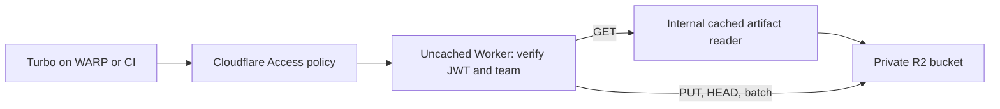

# Cloudflare-native Turborepo remote cache

Hono on Cloudflare Workers, private R2 storage, Cloudflare Access authentication,
and Workers Cache on an internal read entrypoint. No Containers, KV, public R2
endpoint, or shared static cache password.

## Request path



Access controls admission. The Worker independently verifies RS256 signatures,
issuer, audience, expiry and identity. Human identities and Access service-token
identities are supported. A supplied `Cf-Access-Jwt-Assertion` takes precedence;
a bad assertion cannot fall back to a good bearer. A signed Access application
JWT can also be supplied as a bearer for direct protocol testing.

One Worker serves multiple project teams. `teamId` is the canonical key from
[`infra/data/projects.json`](https://github.com/tractorbeamai/infra/blob/main/data/projects.json),
for example `caddi`, `carlyle`, or `linden-investment`. `slug` is an alternative
selector for the same key. At least one is required; duplicates and conflicting
selectors are rejected. There is no default or shared namespace.

Each project has its own hostname (`caddi.cache.tractorbeam.tools`) and Access
application. The policy requires the existing Okta group (`Project: CADDi`),
whose membership is already managed by infra. The Worker maps that application's
verified AUD to the project through `PROJECT_ACCESS`; changing a query parameter
cannot grant another project's access. Read and write audiences can differ,
with the write audience also granting reads. A single project app can occupy
both roles, but reusing an audience across projects fails closed.

Both R2 objects and internal cache URLs include the authorized project key:
`caddi/<hash>` and `carlyle/<hash>` are independent artifacts. First-writer-wins
applies within a project. No membership lists or IdP group claims are copied
into this repository. [Project access](docs/project-access.md) describes the
infra integration and remaining rollout checks.

The gateway always runs before a read reaches the internal cache. It creates a
fresh internal request, so arbitrary query parameters, credentials, cookies,
ranges and conditional headers cannot change the shared response. Only successful
GETs are cached, for five minutes. HEAD uses R2 metadata. Client responses are
`private, no-store`. Cache contents are version-isolated by default. Do not expose
the named `ArtifactReader` entrypoint through another public Worker or service.

Artifacts are opaque streamed bytes. An atomic conditional R2 write implements
first-writer-wins: repeated uploads return success without replacing bytes or
metadata. Different outputs/signing keys for the same task hash require a new
namespace or artifact expiry. R2 lifecycle expiry can leave a cached copy readable
for up to the cache TTL; use purge when immediate deletion is required.

Limits: 64 MiB per artifact, 64 KiB JSON, 128 entries per batch, 256 hexadecimal
characters per artifact hash, and 600 requests/minute per verified identity and project per
Cloudflare location. The rate limiter is abuse control, not a global quota.
Duration, signature tag, source SHA and dirty hash are preserved. Events are
validated and acknowledged without retaining telemetry. No delete/admin API is
exposed.

## Development and verification

Requires Node 24 and uv (for the isolated Schemathesis CLI). There is no Python
project, pytest harness, or Python dependency lockfile. Schemathesis itself is a
Python application; uv manages its runtime and dependencies outside this project.

```sh
npm ci
npm run check
```

The checks run TypeScript, formatting, a deployment dry run, workerd/R2 protocol
and authorization tests, and the pinned Schemathesis CLI against the untouched
upstream OpenAPI document. Node tests verify multi-request artifact workflows.
Tests create ephemeral signing keys and intercept only the JWKS HTTP boundary;
they run the production JWT verifier and real local R2 implementation. There is
no development authentication bypass. The test rate limit is raised for fuzzing;
a separate test exercises enforcement.

`npm run dev` fails closed until Access issuer/audiences are configured. For an
isolated local fixture, the tests manage their own server automatically.
[Contract provenance and CLI exceptions](spec/README.md) describe the exact claims.
Local tests do not establish Access/WARP policy correctness, deployed CDN hits,
or cloud IAM permissions; the deployment checks below cover those boundaries.

## Deployment to tractorbeam-nonprod

Deployment has **not** been performed. The nonprod account ID is
`b534f6f9c114635cacb3cfd15861c516`, verified from current `infra/main` and set in
`wrangler.jsonc`. The connected Cloudflare MCP still has corporate-only access;
a direct read against nonprod returned an authentication error.

1. Review and apply the companion `infra/cloudflare/nonprod/remote-cache.tf`
   change through the infra repository's existing OpenTofu workflow. It owns the
   private bucket, disabled `r2.dev`, 30-day retention, and one Access application
   per project. No public R2 custom domains or developer S3 credentials are needed.
2. Verify native Okta group retrieval in the **nonprod** Access identity provider
   and test each project's Allow policy. A login-method-only workforce policy
   is insufficient. CI needs a separately approved, project-specific Service Auth
   policy; the corporate WARP enrollment token must not grant every project.
3. Set `ACCESS_ISSUER` to the nonprod Access organization's actual issuer. Copy
   the `remote_cache_project_access` output into the `PROJECT_ACCESS` JSON binding.
   These AUDs are public configuration, not credentials. Empty configuration,
   malformed project keys, and cross-project audience reuse fail closed.
4. Confirm the selected hostname routing with infra's Route 53/Cloudflare partial
   zone setup. Attach each `remote_cache_hostnames` output to this Worker only
   after Access protects it. Keep `workers_dev`, preview URLs and default-entrypoint
   caching disabled. Do not attach the internal `ArtifactReader` independently.
5. Use an authorized nonprod Worker deployment credential, then run
   `npm run check` and `npm run deploy`. The documented provider credential source
   is `tractorbeam/cloudflare/nonprod/terraform-provider` in shared-services AWS;
   discovering that source does not authorize exposing or copying its token.
6. Verify real WARP session authentication across the corporate/nonprod boundary.
   The existing corporate organization has WARP authentication disabled globally;
   the new applications enable it explicitly, but corporate enrollment alone does
   not prove authentication to the separate nonprod Access organization. Existing
   Okta device-trust policy remains authoritative for endpoint compliance.
7. Test two project users against the same hash: upload distinct bytes, HEAD,
   download, repeat with a confirmed edge cache hit, and batch lookup. Cross-project
   reads/writes must fail, including after cache hits. Test missing/expired tokens,
   read-only tokens, a project-scoped CI identity, and direct Worker/R2 URLs. Review
   account-wide R2 tokens and human roles; administrators can bypass application
   Access policy through their account permissions.

Rollback: use `npx wrangler rollback` for Worker code. Retain the Access protection
and private bucket settings; a code rollback must never expose the artifacts.

## Client setup

The API is rooted at `/artifacts/...`, with no `/v8` route or compatibility alias.
Stock Turbo hardcodes `/v8/artifacts/...` and therefore cannot use this deployment
directly. Setting `TURBO_API` to the hostname does not remove that prefix; a
modified client is required. Stock-client compatibility is intentionally outside
this implementation's current scope.

Clients must reach the Access-protected hostname through the configured WARP
session or a deliberate CI Service Auth policy. WARP connectivity alone does not
grant access. Access supplies the signed assertion verified by the Worker. For
service tokens, a client must supply `CF-Access-Client-Id` and
`CF-Access-Client-Secret`; a bearer containing the service-token secret is not
equivalent. Never commit credentials or artifact-signing keys.

Artifacts and signature tags remain opaque to the server. Clients should verify
artifact signatures before restoring outputs. This repository's checks use
isolated local infrastructure and require no Cloudflare credentials.

## Sources

- [Turborepo remote-cache specification](https://turborepo.dev/api/remote-cache-spec)
- [Vercel artifact upload API](https://vercel.com/docs/rest-api/artifacts/upload-a-cache-artifact)
- [Cloudflare Access JWT validation](https://developers.cloudflare.com/cloudflare-one/access-controls/applications/http-apps/authorization-cookie/validating-json/)
- [Access human and service application tokens](https://developers.cloudflare.com/cloudflare-one/access-controls/applications/http-apps/authorization-cookie/application-token/)
- [Access session management](https://developers.cloudflare.com/cloudflare-one/access-controls/access-settings/session-management/)
- [Access service tokens](https://developers.cloudflare.com/cloudflare-one/access-controls/service-credentials/service-tokens/)
- [Workers Cache authentication pattern](https://developers.cloudflare.com/workers/cache/examples/)
- [Legacy Cache API limitations](https://developers.cloudflare.com/workers/runtime-apis/cache/)
