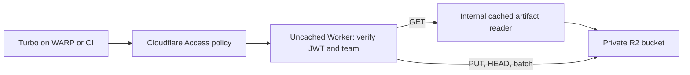

# Cloudflare-native Turborepo remote cache

Hono on Cloudflare Workers, private R2 storage, Cloudflare Access authentication,
and Workers Cache on an internal read entrypoint. No Containers, KV, public R2
endpoint, or shared static cache password.

## Request path



Access controls admission. The Worker independently verifies RS256 signatures,
issuer, audience, expiry and identity. Human identities and Access service-token
identities are supported. A supplied `Cf-Access-Jwt-Assertion` takes precedence;
a bad assertion cannot fall back to a good bearer. A signed Access application
JWT can also be supplied as a bearer for direct protocol testing.

One deployment serves one configured team. `teamId` must match `TEAM_ID` and
`slug` must match `TEAM_SLUG` or `TEAM_ID` (Turbo can send its team setting as a
slug). Omitted selectors use the configured team. Read and write Access audiences
can differ; the write audience also grants reads. Set both to the same app AUD
when every allowed developer should have read/write access. Separate read/write
Access apps and hostnames are needed to enforce different admission policies.

The gateway always runs before a read reaches the internal cache. It creates a
fresh internal request, so arbitrary query parameters, credentials, cookies,
ranges and conditional headers cannot change the shared response. Only successful
GETs are cached, for five minutes. HEAD uses R2 metadata. Client responses are
`private, no-store`. Cache contents are version-isolated by default. Do not expose
the named `ArtifactReader` entrypoint through another public Worker or service.

Artifacts are opaque streamed bytes. An atomic conditional R2 write implements
first-writer-wins: repeated uploads return success without replacing bytes or
metadata. Different outputs/signing keys for the same task hash require a new
namespace or artifact expiry. R2 lifecycle expiry can leave a cached copy readable
for up to the cache TTL; use purge when immediate deletion is required.

Limits: 64 MiB per artifact, 64 KiB JSON, 128 entries per batch, 256 hexadecimal
characters per artifact hash, and 600 requests/minute per verified identity per
Cloudflare location. The rate limiter is abuse control, not a global quota.
Duration, signature tag, source SHA and dirty hash are preserved. Events are
validated and acknowledged without retaining telemetry. No delete/admin API is
exposed.

## Development and verification

Requires Node 24 and uv/Python 3.12+.

```sh
npm ci
uv sync --locked
npm run check
```

The checks run TypeScript, formatting, a deployment dry run, workerd/R2 protocol
and authorization tests, a real signed Turbo build/restore, and Schemathesis
positive/negative contract cases plus generated multi-request workflows.
Tests create ephemeral signing keys and intercept only the JWKS HTTP boundary;
they run the production JWT verifier and real local R2 implementation. There is
no development authentication bypass. The test rate limit is raised for fuzzing;
a separate test exercises enforcement.

`npm run dev` fails closed until Access issuer/audiences are configured. For an
isolated local fixture, the tests manage their own server automatically.
[Contract provenance and adjustments](spec/README.md) describe the exact claims.
Local tests do not establish Access/WARP policy correctness, deployed CDN hits,
or cloud IAM permissions; the deployment checks below cover those boundaries.

## Deployment to tractorbeam-nonprod

Deployment has **not** been performed. The available MCP connection exposes only
`tractorbeam-corporate`, Wrangler is unauthenticated, and the target hostname,
nonprod account ID, and Access app configuration have not been supplied.

1. Authenticate Wrangler with access to `tractorbeam-nonprod`; verify the account
   name and ID with `npx wrangler whoami`. Set that ID as `account_id` in
   `wrangler.jsonc`. Never substitute the corporate account.
2. Choose a hostname in the appropriate Cloudflare zone. Create a self-hosted
   Access application for the entire hostname **before** attaching the Worker.
   Use an Allow policy for the intended developer group with the organization's
   required device posture. Enable Cloudflare One Client/WARP session identity
   in device enrollment and for this application. Do not use a Bypass policy.
   WARP connectivity alone is not an identity/authorization policy.
3. Set `ACCESS_ISSUER` to `https://<team>.cloudflareaccess.com` (no trailing slash)
   and the application AUD in `ACCESS_READ_AUD` and `ACCESS_WRITE_AUD`. These are
   public configuration, not secrets. Keep session durations deliberate; local
   JWT verification alone cannot detect server-side revocation before expiry.
4. Add `routes: [{ "pattern": "<chosen-hostname>", "custom_domain": true }]`
   to `wrangler.jsonc`. Leave `workers_dev` and `preview_urls` disabled, and
   caching disabled on the default entrypoint. The newer Workers Cache handles
   the internal read entrypoint; the older Cache API has an Access limitation.
5. Create the dedicated bucket and retention rule in the verified account:

   ```sh
   npx wrangler r2 bucket create tractorbeam-turbo-cache-nonprod
   npx wrangler r2 bucket lifecycle add tractorbeam-turbo-cache-nonprod expire-artifacts team_tractorbeam/ --expire-days 30
   ```

   Keep `r2.dev` disabled and attach no public bucket custom domains. Do not issue
   S3 credentials to developers. Review existing account-wide R2 API tokens and
   human account roles; they can read directly regardless of the Access policy.
   A binding authorizes the Worker, but is not an IAM deny against account admins.

6. Run `npm run typegen`, `npm run check`, and `npm run deploy`. The deploy wrapper
   refuses incomplete account/domain/Access configuration and public previews.
7. Verify with a managed WARP client: status, upload, HEAD, download, repeated
   download with an actual CDN hit, and real Turbo restoration. Also test an
   unmanaged client, expired/invalid credentials, a different team, and direct
   Worker/bucket URLs. Confirm denial after a cache hit and verify no public R2
   access. Repeat the read/write audience matrix if using separate apps.

Rollback: use `npx wrangler rollback` for Worker code. Retain the Access protection
and private bucket settings; a code rollback must never expose the artifacts.

## Turbo client setup

On a managed WARP device, once Access session authentication is confirmed:

```sh
export TURBO_API=https://<chosen-hostname>
export TURBO_TEAM=tractorbeam
export TURBO_TOKEN=access-managed
```

The placeholder satisfies Turbo's token setting; it grants no access itself.
Access supplies the signed assertion after authenticating the WARP session.
Enable `remoteCache.signature: true` in the consuming repository's `turbo.json`
and distribute a separate random `TURBO_REMOTE_CACHE_SIGNATURE_KEY` through your
secret manager. Never commit that key, JWTs or service-token secrets. Anyone with
a symmetric signing key can create signatures; read-only server permissions
still matter.

CI needs a deliberate Access path: an enrolled runner, or a Service Auth policy
and a client/proxy that supplies `CF-Access-Client-Id` and
`CF-Access-Client-Secret`. Turbo's `TURBO_TOKEN` sends a Bearer header; setting it
to an Access service-token secret is **not** equivalent to sending the required
header pair. Verify the selected runner path before enabling remote cache in CI.
The Worker accepts the resulting signed service application JWT. This repository's
checks use isolated local infrastructure and require no Cloudflare credentials.

## Sources

- [Turborepo remote-cache specification](https://turborepo.dev/api/remote-cache-spec)
- [Vercel artifact upload API](https://vercel.com/docs/rest-api/artifacts/upload-a-cache-artifact)
- [Cloudflare Access JWT validation](https://developers.cloudflare.com/cloudflare-one/access-controls/applications/http-apps/authorization-cookie/validating-json/)
- [Access human and service application tokens](https://developers.cloudflare.com/cloudflare-one/access-controls/applications/http-apps/authorization-cookie/application-token/)
- [Access session management](https://developers.cloudflare.com/cloudflare-one/access-controls/access-settings/session-management/)
- [Access service tokens](https://developers.cloudflare.com/cloudflare-one/access-controls/service-credentials/service-tokens/)
- [Workers Cache authentication pattern](https://developers.cloudflare.com/workers/cache/examples/)
- [Legacy Cache API limitations](https://developers.cloudflare.com/workers/runtime-apis/cache/)
