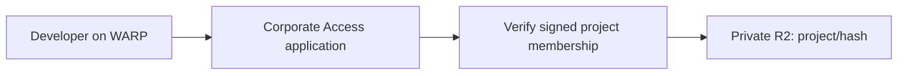

# Cloudflare-native Turborepo remote cache

Hono on Cloudflare Workers with private R2 storage and one corporate Cloudflare
Access application. The Worker runs in the same Access organization as developer
WARP enrollment.



## Authorization

The corporate [infra stack](https://github.com/tractorbeamai/infra/pull/1541)
creates one Access application for `*.cache.tractorbeam.tools`. Its Allow policy
admits the existing Okta groups of projects with `remote_cache: true` in
`infra/data/projects.json`. The shared Okta integration forwards a filtered
`Project: ` groups claim. The Worker verifies the application JWT's signature,
issuer, audience, expiry and identity, then requires the exact project group in
its signed `custom.groups` claim. Missing, malformed and oversized claims deny
access. Caller-supplied group headers never grant permission.

`teamId` is a project key such as `caddi` or `linden-investment`; `slug` is an
alternative selector. At least one is required, and duplicates or conflicting
selectors are rejected. The hostname does not grant project permission. Reads
and writes use the same group check. R2 keys include the authorized project, so
identical hashes in different projects remain independent.

`vars.PROJECTS` in [wrangler.jsonc](wrangler.jsonc) must match the applied
`remote_cache_project_groups` Terraform output. Deploy the Worker after every
project flag or group-name change. **Disabling a project is complete only after
the Worker map is updated.** Someone who also belongs to an enabled project can
still pass Access admission with a stale Worker map. The shared identity config
bounds all registered project group names below 700 bytes and 64 groups, leaving
headroom under Cloudflare's approximate 1 KB custom-claim limit.

Access service tokens do not have human group memberships. `SERVICE_PROJECTS` is
empty by default, so the Worker rejects them. If CI access is later needed, add a
narrow Service Auth policy in infra and map that token's public client ID to only
its enabled project keys in `wrangler.jsonc`. The secret does not belong in Git.

## Storage and limits

GET streams directly from R2; HEAD reads object metadata. There is no CDN or
Worker response cache. Client responses use `private, no-store`. Infra disables
the bucket's `r2.dev` endpoint and expires objects after 30 days and incomplete
multipart uploads after one day. Developers do not need R2 credentials.

Uploads stream with atomic first-writer-wins behavior. Retries cannot replace an
existing artifact's bytes or metadata. Limits: 64 MiB per artifact, 64 KiB JSON,
128 entries per batch, 256 hexadecimal characters per hash, and 600 requests per
minute per verified identity/project per Cloudflare location. The rate limiter
is abuse control, not a global quota. Metadata and signature tags are preserved;
cache event reports are acknowledged without storing build telemetry.

## Development and verification

Requires Node 24 and uv for the isolated Schemathesis CLI. There is no Python
project or Python lockfile; uv manages Schemathesis's runtime and dependencies.

```sh
pnpm install --frozen-lockfile
pnpm check
```

Checks include TypeScript, formatting, a Wrangler dry run, Vitest protocol and
security tests in Cloudflare's Workers runtime with local R2, and Schemathesis against the unchanged upstream
OpenAPI document. Test fixtures sign ephemeral JWTs and mock only JWKS retrieval.
[Contract provenance and exceptions](spec/README.md) describe the coverage.
Local tests do not establish live Access or WARP behavior.

## Deployment

`pnpm deploy` creates or updates the Worker, its route, bindings, rate-limit
configuration, observability settings and non-secret variables from
`wrangler.jsonc`. Terraform does not track those Worker-owned settings. Infra
owns the Access application, Okta claim forwarding, R2 bucket, privacy and
retention. The R2 binding names that existing bucket; it does not request
Wrangler's automatic bucket provisioning. No custom setup or deployment
orchestration is needed.

1. Apply [infra PR #1541](https://github.com/tractorbeamai/infra/pull/1541)
   through its normal workflow. Copy `remote_cache_access_aud` into `vars.ACCESS_AUD`
   and `remote_cache_project_groups` into `vars.PROJECTS` here. These values are
   public configuration, not secrets.
2. Authenticate a managed device again and verify its signed Access application
   JWT includes the expected `custom.groups`. The app enables WARP authentication
   explicitly; infra does not change the organization-wide setting.
3. Establish corporate zone, proxy and TLS routing for
   `*.cache.tractorbeam.tools`, preserving Route 53 DNS ownership. The Wrangler
   route does not create a zone or change authoritative DNS.
4. Use an authorized corporate Wrangler session or scoped API token, then run
   `pnpm check` and `pnpm deploy`. Wrangler has `workers_dev` and previews
   disabled. Test two projects with the same hash, absent group claims, direct
   bucket access and alternate Worker URLs before considering rollout complete.

Current status: not deployed. The connected corporate API returned no
`tractorbeam.tools` zone, Wrangler has no usable login/API token, and the shared
identity change has not been applied. The empty `ACCESS_AUD` leaves the Worker
fail closed until the actual Terraform output is copied. Keep the Access policy
and private bucket settings in place when rolling back Worker code.

## Client setup

The API is rooted at `/artifacts/...`, with no `/v8` compatibility route.
Stock Turbo hardcodes `/v8/artifacts/...`, so a modified client is required;
setting `TURBO_API` does not remove that prefix.

A client for CADDi uses `https://caddi.cache.tractorbeam.tools` with
`teamId=caddi`. Access supplies the signed `Cf-Access-Jwt-Assertion`; it takes
precedence over any bearer token. A signed application JWT can also be supplied
as a bearer for protocol testing. An invalid assertion cannot fall back to a
valid bearer. Clients should verify artifact signatures before restoring outputs.

## Sources

- [Turborepo remote-cache specification](https://turborepo.dev/api/remote-cache-spec)
- [Access JWT validation](https://developers.cloudflare.com/cloudflare-one/access-controls/applications/http-apps/authorization-cookie/validating-json/)
- [Application tokens and custom-claim limits](https://developers.cloudflare.com/cloudflare-one/access-controls/applications/http-apps/authorization-cookie/application-token/)
- [Custom OIDC claims](https://developers.cloudflare.com/cloudflare-one/integrations/identity-providers/generic-oidc/#custom-oidc-claims)
