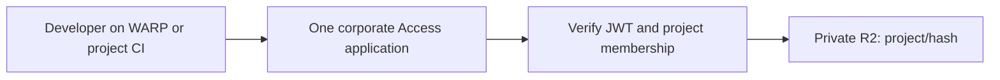

# Cloudflare-native Turborepo remote cache

Hono on Cloudflare Workers with private R2 storage and Cloudflare Access.
The service runs in the corporate account alongside the existing WARP organization.



## Authorization

One Access application protects `*.cache.tractorbeam.tools`. It admits members of
an enabled project's existing Okta group. The Worker verifies the Access JWT's
RS256 signature, issuer, audience, expiry, application-token type, and identity.
Admission alone does not authorize an artifact: the signed `custom.groups` claim
must include the requested project's exact `Project: <display_name or name>` group.
Missing, malformed, or oversized claims deny access. Caller-supplied group headers
are never trusted, and no identity lookup runs on artifact requests.

`teamId` is a key from
[infra/data/projects.json](https://github.com/tractorbeamai/infra/blob/main/data/projects.json),
such as `caddi` or `linden-investment`. `slug` is an alternative for the same key.
At least one selector is required; repeated or conflicting selectors are rejected.
The hostname does not grant project permission. Both reads and writes use the
same membership check. R2 keys include the authorized project, so identical hashes
in different projects remain independent.

Only projects with `remote_cache: true` are enabled. `npm run sync-projects` reads
the registry from infra's main branch and updates `[vars.PROJECTS]` in
`wrangler.toml`. `npm run deploy` always performs this sync first. Redeploy after
changing project flags or group names. For reviewing an unmerged registry locally:

```sh
npm run sync-projects -- /path/to/infra/data/projects.json
```

The shared Okta integration emits only `Project: ` memberships. Infra and the sync
command bound the worst-case claim below 700 bytes and 64 groups, including
projects without caches. Access may omit large custom claims; the Worker rejects
missing claims instead of granting broader access. Group removal takes effect
when the identity/session refreshes; disable a project's namespace and redeploy
when all access to that project must stop immediately.

Service tokens have no user memberships. `[vars.SERVICE_PROJECTS]` maps Access
client IDs (public identifiers, never client secrets) to allowed project keys.
It is empty by default. Setup resolves those IDs to existing service tokens and
creates a narrowly scoped Service Auth policy. The Worker independently enforces
the map. Changing a query parameter cannot expand a CI identity's permissions.

## Storage and limits

GET streams directly from private R2; HEAD reads object metadata. There is no CDN
or Worker response cache. Client responses are `private, no-store`.

Uploads stream with atomic first-writer-wins behavior: retries do not replace an
existing artifact's bytes or metadata. Objects expire after 30 days and incomplete
multipart uploads after one day. The bucket has no public custom domains and its
`r2.dev` endpoint is disabled. Developers do not need R2 credentials.

Limits: 64 MiB per artifact, 64 KiB JSON, 128 entries per batch, 256 hexadecimal
characters per hash, and 600 requests/minute per verified identity/project per
Cloudflare location. The rate limiter is abuse control, not a global quota.
Duration, signature tag, source SHA and dirty hash are preserved. Events are
validated and acknowledged without storing build telemetry. There is no delete API.

## Development and verification

Requires Node 24 and uv for the isolated Schemathesis CLI. There is no Python
project or Python lockfile; uv manages Schemathesis's own runtime and dependencies.

```sh
npm ci
npm run check
```

Checks include TypeScript, formatting, a deployment dry run, real local workerd/R2
security and protocol tests, and Schemathesis against the unchanged upstream
OpenAPI document. Test fixtures sign ephemeral Access JWTs and mock only JWKS
retrieval. They do not bypass the production authorization code.
[Contract provenance and exceptions](spec/README.md) describe the exact coverage.

`npm run dev` fails closed until a real issuer/audience and identity are available.
The automated tests provide their own isolated local server and identity fixture.

## Configuration and deployment

This repo owns the Worker and its supporting cache resources:

| File                           | Responsibility                                                                      |
| ------------------------------ | ----------------------------------------------------------------------------------- |
| `wrangler.toml`                | Corporate account, routes, R2 binding, issuer/audience, project and CI maps, limits |
| `cloudflare/access.json`       | Single Access application, corporate Okta provider, WARP authentication             |
| `cloudflare/r2-lifecycle.json` | Artifact and multipart expiry                                                       |
| `scripts/setup.mjs`            | Reconcile Access through its API; manage private R2 with Wrangler                   |

Wrangler does not declare production Access policies or R2 lifecycle rules in
TOML. The small setup command keeps those settings in this repo rather than infra.
Infra retains only shared Okta/Access claim forwarding and project definitions.
See [project access](docs/project-access.md) for the identity integration.

1. Apply [infra PR #1541](https://github.com/tractorbeamai/infra/pull/1541) through
   its normal workflow. This adds the filtered Okta groups claim and Access claim
   forwarding. It creates no cache-specific resources.
2. Authenticate a managed device again and verify the signed Access application
   JWT contains `custom.groups` through WARP. The app enables WARP authentication
   explicitly; no organization-wide authentication setting is changed.
3. Establish corporate routing for `*.cache.tractorbeam.tools`, preserving Route
   53 DNS ownership and the appropriate Cloudflare zone, proxy, and TLS setup.
   `wrangler.toml` declares the intended Worker route; it does not create a zone
   or change authoritative DNS.
4. Supply a scoped `CLOUDFLARE_API_TOKEN` through your approved local or CI secret
   environment. Setup needs Access app management, IdP metadata read, R2 management,
   and service-token metadata read if CI mappings are configured. Deployment also
   needs Worker and route management. Never commit the token.
5. Sync and preview the desired Access application, then run checks and deploy:

   ```sh
   npm run sync-projects
   npm run setup
   npm run check
   npm run deploy
   ```

`npm run setup` only previews. `npm run setup -- --apply` reconciles the Access app
and private bucket and writes the public audience tag into `wrangler.toml`.
Deployment syncs projects, reconciles setup, and calls Wrangler. Setup refuses to
proceed until the corporate IdP forwards `groups`. It replaces this cache app's
policies and bucket lifecycle with the checked-in definitions; edit those sources
instead of making dashboard changes. Commit refreshed project mappings and AUD.

Before declaring rollout complete, verify authorized WARP upload/download,
missing-claim denial, denial between two projects, mapped/unmapped CI identities,
and denial at direct R2 and alternate Worker URLs. Keep `workers_dev` and preview
URLs disabled. Account administrators and independent R2 credentials remain
separate access paths; review their permissions separately.

Current status: not deployed. Wrangler has no usable login/API token, the shared
claim changes are pending in infra, and the connected corporate API returned no
`tractorbeam.tools` zone. These must be resolved before publishing the route.

Rollback Worker code with `npx wrangler rollback`. Retain Access and bucket privacy.
Rolling back project maps or service allowlists can restore access, so review them
alongside the code version.

## Client setup

The API is rooted at `/artifacts/...`, with no `/v8` compatibility route.
Stock Turbo hardcodes `/v8/artifacts/...`, so a modified client is still required;
setting `TURBO_API` does not remove that prefix.

Use `https://caddi.cache.tractorbeam.tools` with `teamId=caddi`, for example.
Access supplies the signed `Cf-Access-Jwt-Assertion`; it takes precedence over any
bearer token. A signed application JWT may also be supplied as a bearer for
protocol testing. An invalid assertion never falls back to a valid bearer.

CI clients supply `CF-Access-Client-Id` and `CF-Access-Client-Secret`. The secret
itself is not an application JWT. Clients should verify artifact signatures before
restoring outputs; the server stores artifacts and signature tags as opaque data.

## Sources

- [Turborepo remote-cache specification](https://turborepo.dev/api/remote-cache-spec)
- [Access JWT validation](https://developers.cloudflare.com/cloudflare-one/access-controls/applications/http-apps/authorization-cookie/validating-json/)
- [Access application tokens and custom-claim limits](https://developers.cloudflare.com/cloudflare-one/access-controls/applications/http-apps/authorization-cookie/application-token/)
- [Custom OIDC claims](https://developers.cloudflare.com/cloudflare-one/integrations/identity-providers/generic-oidc/#custom-oidc-claims)
- [Access session management](https://developers.cloudflare.com/cloudflare-one/access-controls/access-settings/session-management/)
