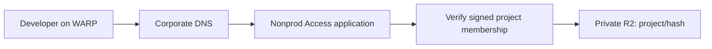

# Cloudflare-native Turborepo remote cache

Hono on a nonprod Cloudflare Worker with private R2 storage and one nonprod
Access application. Corporate owns the `tractorbeam.tools` DNS zone; exact
project hostnames are served by nonprod through Cloudflare for SaaS.


```mermaid
flowchart LR
  Client[Developer on WARP] --> DNS[Corporate DNS]
  DNS --> Access[Nonprod Access application]
  Access --> Worker[Verify signed project membership]
  Worker --> R2[Private R2: project/hash]
```

## Authorization

The nonprod [infra stack](https://github.com/tractorbeamai/infra/pull/1541)
stages exact project hostnames and one Worker-level Access application. Its Allow policy
admits the existing Okta groups of projects with `remote_cache: true` in
`infra/data/projects.json`. The nonprod Okta integration forwards a filtered
`Project: ` groups claim. The Worker verifies the application JWT's signature,
issuer, audience, expiry and identity, then requires the exact project group in
its signed `custom.groups` claim. Missing, malformed and oversized claims deny
access. Caller-supplied group headers never grant permission.

`teamId` is a project key such as `caddi` or `linden-investment`; `slug` is an
alternative selector. At least one is required, and duplicates or conflicting
selectors are rejected. The hostname does not grant project permission. Reads
and writes use the same group check. R2 keys include the authorized project, so
identical hashes in different projects remain independent.

`vars.PROJECTS` in [wrangler.jsonc](wrangler.jsonc) must match the applied
`remote_cache_project_groups` Terraform output. Deploy the Worker after every
project flag or group-name change. **Disabling a project is complete only after
the Worker map is updated.** Someone who also belongs to an enabled project can
still pass Access admission with a stale Worker map. The shared identity config
bounds all registered project group names below 700 bytes and 64 groups, leaving
headroom under Cloudflare's approximate 1 KB custom-claim limit.

Access service tokens do not have human group memberships. `SERVICE_PROJECTS` is
empty by default, so the Worker rejects them. If CI access is later needed, add a
narrow Service Auth policy in infra and map that token's public client ID to only
its enabled project keys in `wrangler.jsonc`. The secret does not belong in Git.

## Storage and limits

GET streams directly from R2; HEAD reads object metadata. There is no CDN or
Worker response cache. Client responses use `private, no-store`. Infra disables
the bucket's `r2.dev` endpoint and expires objects after 30 days and incomplete
multipart uploads after one day. Developers do not need R2 credentials.

Uploads stream with atomic first-writer-wins behavior. Retries cannot replace an
existing artifact's bytes or metadata. Limits: 64 MiB per artifact, 64 KiB JSON,
128 entries per batch, 256 hexadecimal characters per hash, and 600 requests per
minute per verified identity/project per Cloudflare location. The rate limiter
is abuse control, not a global quota. Metadata and signature tags are preserved;
cache event reports are acknowledged without storing build telemetry.

## Development and verification

Requires Node 24 and uv for the isolated Schemathesis CLI. There is no Python
project or Python lockfile; uv manages Schemathesis's runtime and dependencies.

```sh
pnpm install --frozen-lockfile
pnpm check
```

Checks include TypeScript, formatting, a Wrangler dry run, HTTP-level Vitest
protocol and security tests against local workerd and R2, a real Turbo CLI cache
miss and remote hit, a small Cloudflare Vitest runtime check, and Schemathesis
against the unchanged upstream OpenAPI document. Test fixtures sign ephemeral
JWTs and mock only JWKS retrieval.
[Contract provenance and exceptions](spec/README.md) describe the coverage.
Local tests do not establish live Access or WARP behavior.

## Deployment

`pnpm deploy` creates or updates the nonprod Worker, R2 binding, rate-limit
configuration, observability settings and non-secret variables from
`wrangler.jsonc`. Terraform owns exact SaaS hostnames, corporate DNS CNAMEs,
Worker routes, Access, Okta claim forwarding, R2 privacy and retention.
The R2 binding names the existing bucket.

1. Apply [infra PR #1541](https://github.com/tractorbeamai/infra/pull/1541)
   through its normal workflow. It stages the bucket and custom hostnames with
   routes disabled. Apply the corporate DNS records and verify every hostname's
   TLS certificate is active.
2. Use an authorized nonprod Wrangler session or scoped API token to run
   `pnpm check` and `pnpm deploy`. The initial `ACCESS_AUD` is empty, so the
   unrouted Worker fails closed. `workers_dev` and previews are disabled.
3. Enable `remote_cache_routing_enabled` in the nonprod infra stack only after
   the Worker exists and the hostnames are active. Apply its Worker-level Access
   app and exact routes, then copy `remote_cache_access_aud` and
   `remote_cache_project_groups` into `wrangler.jsonc` and redeploy.
4. Verify anonymous denial, a fresh WARP session's signed `custom.groups`,
   allowed access and cross-project denial on two hostnames, and disabled direct
   R2 and alternate Worker access.

Current status: not deployed. The empty `ACCESS_AUD` leaves the Worker fail
closed until the Access app is applied and its audience is copied. The Cloudflare
connector can inspect corporate resources but is not authorized for nonprod
account resources, and Wrangler has no usable login/API token.

## Client setup

The canonical API is rooted at `/artifacts/...`. The Worker also accepts
`/v8/artifacts/...` for stock Turbo, which appends `/v8` to `TURBO_API`.

A client for CADDi uses `TURBO_API=https://caddi.cache.tractorbeam.tools`,
`TURBO_TEAM=caddi`, and a signed Access application JWT as `TURBO_TOKEN`.
Access's `Cf-Access-Jwt-Assertion` takes precedence over that bearer token.
The local real-Turbo test uses this setup. An invalid assertion cannot fall
back to a valid bearer. Clients should verify artifact signatures before
restoring outputs.

Use `TURBO_TEAM` (the project slug) rather than `TURBO_TEAMID`: Turbo accepts a
team ID only when it begins with `team_`, while our project keys do not. Clients
may set `remoteCache.signature: true` and share a secret of at least 32 bytes
through `TURBO_REMOTE_CACHE_SIGNATURE_KEY`; the Worker preserves the resulting
`x-artifact-tag`. Turbo caches task logs along with outputs, so tasks must not
print secrets. Keep `remoteCache.preflight` at its default `false`: in the tested
Turbo 2.11.3 flow, enabling it sends the bearer token on `OPTIONS` but omits it
from the following artifact request, which this Worker correctly denies.

## Sources

- [Turborepo remote-cache specification](https://turborepo.dev/api/remote-cache-spec)
- [Access JWT validation](https://developers.cloudflare.com/cloudflare-one/access-controls/applications/http-apps/authorization-cookie/validating-json/)
- [Application tokens and custom-claim limits](https://developers.cloudflare.com/cloudflare-one/access-controls/applications/http-apps/authorization-cookie/application-token/)
- [Custom OIDC claims](https://developers.cloudflare.com/cloudflare-one/integrations/identity-providers/generic-oidc/#custom-oidc-claims)
